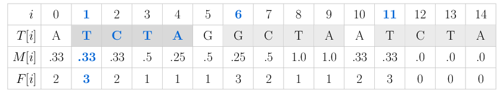

GenMap: Ultra-fast Computation of Genome Mappability
====================================================

.. image:: https://img.shields.io/conda/dn/bioconda/genmap.svg?style=flag&label=BioConda%20install
    :target: https://anaconda.org/bioconda/genmap
    :alt: BioConda Install
.. image:: https://img.shields.io/github/downloads/cpockrandt/genmap/total.svg
    :target: https://github.com/cpockrandt/genmap/releases/latest
    :alt: Github All Releases
.. image:: https://travis-ci.org/cpockrandt/genmap.svg?branch=master
    :target: https://travis-ci.org/cpockrandt/genmap
    :alt: Travis CI
.. image:: https://img.shields.io/badge/License-BSD%203--Clause-blue.svg
    :target: https://opensource.org/licenses/BSD-3-Clause
    :alt: BSD3 License

.. contents::
   :local:
   :depth: 2

Introduction
^^^^^^^^^^^^

GenMap computes the uniqueness of k-mers for each position in the genome while allowing for up to e mismatches.
More formally, the uniqueness or (k,e)-mappability can be described for every position as the reciprocal value of how often each k-mer occurs approximately in the genome, i.e., with up to e mismatches.
Hence, a mappability value of 1 at position i indicates that the k-mer in the sequence at position i occurs only once in the sequence with up to e errors.
A low mappability value indicates that this k-mer belongs to a repetitive region.
GenMap can be applied to single or multiple genomes and helps finding regions that are unique or shared by many or all genomes.

Below you can see the (4,1)-mappability and frequency ``M`` and ``F`` of the nucleotide sequence ``T = ATCTAGGCTAATCTA``.
The mappability value ``M[1] = 0.33`` means that the 4-mer starting at position 1 ``T[1..3] = TCTA`` occurs three times in the sequence with up to one mismatch: at positions ``1 (TCTA)``, ``6 (GCTA)`` and ``11 (TCTA)``.

The mappability can be exported in various formats that allow post-processing or display in genome browsers.
A small example on how to run GenMap is listed below, further details are on the `GitHub Wiki pages <https://github.com/cpockrandt/genmap/wiki>`_.
For questions or feature requests feel free to open an issue on GitHub or send an e-mail to ``christopher.pockrandt [ÄT] fu-berlin.de``.

Christopher Pockrandt, Mai Alzamel, Costas S. Iliopoulos, Knut Reinert. **GenMap: Ultra-fast Computation of Genome Mappability**. `Bioinformatics`_, 2020.

.. _Bioinformatics: https://doi.org/10.1093/bioinformatics/btaa222

Installation
^^^^^^^^^^^^

Bioconda
""""""""

::

    $ conda install -c bioconda genmap

Binaries
""""""""

Your CPU must support the ``POPCNT`` instruction.
If you have a modern CPU, you can go with the optimized 64 bit version that additionally uses SSE4.
This improves the running time by 10 %.
To verify whether your CPU supports these instructions sets you can check the output of
``cat /proc/cpuinfo | grep -E "mmx|sse|popcnt"`` (Linux) or
``sysctl -a | grep -i -E "mmx|sse|popcnt"`` (Mac).

.. Source of linux.svg: https://svgsilh.com/image/2025536.html
.. Source of apple.svg: https://svgsilh.com/image/2962084.html

+---------------------------------+---------------------------+--------------------------+-----------------------------+
| **Platform**                    | **Download**              | **Version**              | **Additional requirements** |
+---------------------------------+---------------------------+--------------------------+-----------------------------+
| .. image:: .github/linux.svg    | `Linux 64 bit`_           | |VERSION| (|BUILD_DATE|) | \-                          |
+   :alt: Download Linux binaries +---------------------------+--------------------------+-----------------------------+
|   :height: 60px                 | `Linux 64 bit optimized`_ | |VERSION| (|BUILD_DATE|) | requires SSE4               |
+---------------------------------+---------------------------+--------------------------+-----------------------------+
| .. image:: .github/apple.svg    | `Mac 64 bit`_             | |VERSION| (|BUILD_DATE|) | \-                          |
+   :alt: Download Mac binaries   +---------------------------+--------------------------+-----------------------------+
|   :height: 60px                 | `Mac 64 bit optimized`_   | |VERSION| (|BUILD_DATE|) | requires SSE4               |
+---------------------------------+---------------------------+--------------------------+-----------------------------+

.. _Linux 64 bit: https://github.com/cpockrandt/genmap/releases/download/genmap-v1.2.0/genmap-1.2.0-Linux-x86_64.zip
.. _Linux 64 bit optimized: https://github.com/cpockrandt/genmap/releases/download/genmap-v1.2.0/genmap-1.2.0-Linux-x86_64-sse4.zip
.. _Mac 64 bit: https://github.com/cpockrandt/genmap/releases/download/genmap-v1.2.0/genmap-1.2.0-Darwin-x86_64.zip
.. _Mac 64 bit optimized: https://github.com/cpockrandt/genmap/releases/download/genmap-v1.2.0/genmap-1.2.0-Darwin-x86_64-sse4.zip

.. |VERSION| replace:: 1.2.0
.. |BUILD_DATE| replace:: 2020-02-21

Building from source
""""""""""""""""""""

If you want to build it from source, we recommend cloning the git repository as shown below.
The tarballs on GitHub do not contain git submodules (i.e., SeqAn).
Please note that building from source can easily take 10 minutes and longer depending on your machine and compiler.

::

    $ git clone --recursive https://github.com/cpockrandt/genmap.git
    $ mkdir genmap-build && cd genmap-build
    $ cmake ../genmap -DCMAKE_BUILD_TYPE=Release
    $ make genmap

You can install genmap as follows

::

    $ sudo make install
    $ genmap

or run the binary directly:

::

    $ ./genmap

If you are using a very old version of Git (< 1.6.5) the flag ``--recursive`` does not exist.
In this case you need to clone the submodule separately before you can run ``cmake``:

::

    $ git clone https://github.com/cpockrandt/genmap.git
    $ cd genmap
    $ git submodule update --init --recursive

**Requirements**

Operating System
  GNU/Linux, Mac

Architecture
  Intel/AMD platforms that support ``POPCNT``

Compiler
  GCC ≥ 4.9, LLVM/Clang ≥ 3.8

Build system
  CMake ≥ 3.0

Language support
  C++14

Getting started
^^^^^^^^^^^^^^^

Building the index
""""""""""""""""""

At first you have to build an index of the fasta file(s) whose mappability you want to compute.
This step only has to be performed once.
You might want to check out pre-built indices available for `download <#pre-built-indices>`_.

::

    $ ./genmap index -F /path/to/fasta.fasta -I /path/to/index/folder

A new folder ``/path/to/index/folder`` will be created to store the index and all associated files.

There are two algorithms that can be chosen for index construction.
One uses RAM (radix), one uses secondary memory (skew).
Depending on the quota and main memory limitations you can choose the appropriate algorithm with ``-A radix`` or
``-A skew``.
It is recommended to use Skew, since Radix is comparison-based and therefore significantly slower on repetitive data.
For skew you can change the location of the temp directory via the environment variable (e.g., to choose a directory
with more quota):

::

   $ export TMPDIR=/somewhere/else/with/more/space

Computing the mappability
"""""""""""""""""""""""""

To compute the (30,2)-mappability of the previously indexed genome, simply run:

::

    $ ./genmap map -K 30 -E 2 -I /path/to/index/folder -O /path/to/output/folder -t -w -bg

This will create a ``text``, ``wig`` and ``bedGraph`` file in ``/path/to/output/folder`` storing the computed mappability in
different formats. You can omit formats that are not required by removing the corresponding flags ``-t`` ``-w`` or ``-bg``.

Instead of the mappability, the frequency can be outputted, you only have to add the flag ``-fl`` to the previous
command.

Help pages and examples
"""""""""""""""""""""""

A detailed list of arguments and explanations can be retrieved with ``--help``:

::

    $ ./genmap --help
    $ ./genmap index --help
    $ ./genmap map --help

More detailed examples can be found in the `Wiki <https://github.com/cpockrandt/genmap/wiki>`_.

Pre-built indices
^^^^^^^^^^^^^^^^^

Building an index on a large genome takes some time and requires a lot of space. Hence, we provide indexed genomes for download.
If you need other genomes indexed and do not have the computational resources, please send an e-mail to ``christopher.pockrandt [ÄT] fu-berlin.de``.
The genomes where built with a higher sampling value (`-S 20`) to reduce the index size.
To increase speed when computing the mappability and outputting csv files, you can build your own index with a lower sampling value.
The genomes do not contain alt scaffolds (i.e., only chromosomes and unplaced/unlocalized fragments).

+------------------------------+-----------------------------+--------------------+
| **Genome**                   | **Index size (compressed)** | **Download**       |
+------------------------------+-----------------------------+--------------------+
| Human GRCh38 [1]_            | 5.4 GB                      | `GRCh38 index`_    |
+------------------------------+-----------------------------+--------------------+
| Human hs37-1kg [2]_          | 5.4 GB                      | `hs37-1kg index`_  |
+------------------------------+-----------------------------+--------------------+
| `Mouse GRCm38`_              | 4.9 GB                      | `GRCm38 index`_    |
+------------------------------+-----------------------------+--------------------+
| `\D. melanogaster dm6`_      | 0.2 GB                      | `dm6 index`_       |
+------------------------------+-----------------------------+--------------------+
| `\C. elegans ce11`_          | 0.1 GB                      | `ce11 index`_      |
+------------------------------+-----------------------------+--------------------+
| Wheat T. aestivum ta45 [3]_  | 21.9 GB                     | `ta45 index`_      |
+------------------------------+-----------------------------+--------------------+

.. [1] ftp://ftp.ncbi.nlm.nih.gov/genomes/all/GCA/000/001/405/GCA_000001405.15_GRCh38/seqs_for_alignment_pipelines.ucsc_ids/GCA_000001405.15_GRCh38_no_alt_analysis_set.fna.gz
.. [2] ftp://ftp-trace.ncbi.nih.gov/1000genomes/ftp/technical/reference/human_g1k_v37.fasta.gz
.. [3] ftp://ftp.ensemblgenomes.org/pub/plants/release-45/fasta/triticum_aestivum/dna/Triticum_aestivum.IWGSC.dna.toplevel.fa.gz

.. _`Mouse GRCm38`:           http://hgdownload.soe.ucsc.edu/goldenPath/mm10/chromosomes (merged into one fasta file)
.. _`D. melanogaster dm6`:    http://hgdownload.soe.ucsc.edu/goldenPath/dm6/bigZips/dm6.fa.gz
.. _`C. elegans ce11`:        http://hgdownload.soe.ucsc.edu/goldenPath/ce11/chromosomes (merged into one fasta file)

.. _`GRCh38 index`:   http://ftp.imp.fu-berlin.de/pub/cpockrandt/genmap/indices/grch38-no-alt.tar.gz
.. _`hs37-1kg index`: http://ftp.imp.fu-berlin.de/pub/cpockrandt/genmap/indices/hs37-1kg.tar.gz
.. _`GRCm38 index`:   http://ftp.imp.fu-berlin.de/pub/cpockrandt/genmap/indices/grcm38.tar.gz
.. _`dm6 index`:      http://ftp.imp.fu-berlin.de/pub/cpockrandt/genmap/indices/dm6.tar.gz
.. _`ce11 index`:     http://ftp.imp.fu-berlin.de/pub/cpockrandt/genmap/indices/ce11.tar.gz
.. _`ta45 index`:     http://ftp.imp.fu-berlin.de/pub/cpockrandt/genmap/indices/ta45.tar.gz
